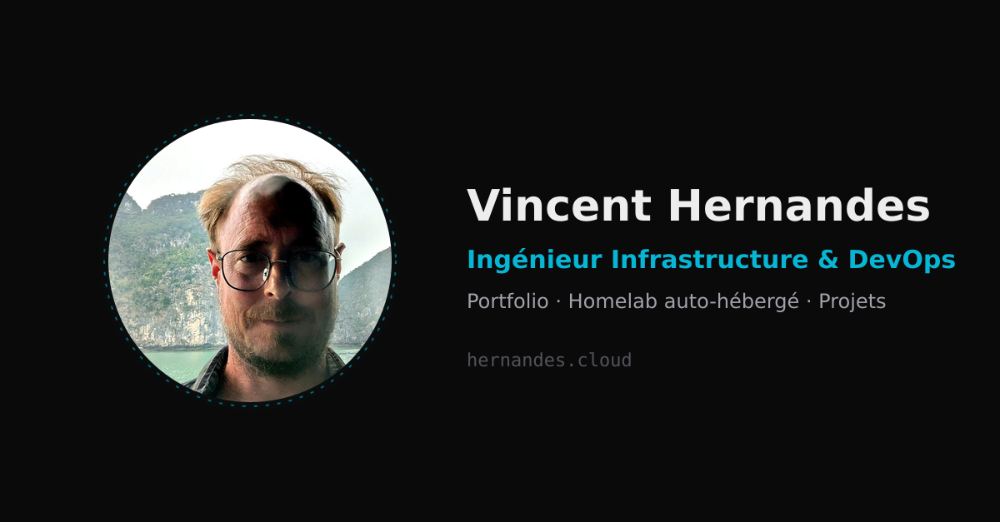

<p align="center">
  
</p>

<h1 align="center">hernandes.cloud</h1>

<p align="center">
  Portfolio personnel et porte d'entrée de mon SI auto-hébergé.
  <br>
  <a href="https://hernandes.cloud"><strong>hernandes.cloud →</strong></a>
</p>

<p align="center">
  
  
  
  
  <a href="https://github.com/vh7383/hernandes.cloud/actions/workflows/deploy.yml"></a>
</p>

Ce dépôt est le code du site que j'utilise pour me présenter et exposer mon infra perso : portfolio (projets, expériences, engagements associatifs), hub vers mes services auto-hébergés (Nextcloud, Vaultwarden, Plex, photos, vidéosurveillance...), un chatbot d'accueil adossé à un système d'IA auto-hébergé que je maîtrise de bout en bout (Gabrielle), et un tableau de bord de monitoring public - le tout déployé sur mon infra perso (VPS + serveur local).

Ce projet me sert surtout de terrain d'apprentissage pour la gestion en conditions réelles d'un domaine public - infra, sécurité, méthode de travail avec documentation continue et décisions tracées au fil de l'eau (voir [`docs/`](./docs)) - Next.js/React n'en étant qu'un des vecteurs.

## Fonctionnalités

- **Portfolio** ([`/`](https://hernandes.cloud), [`/about`](https://hernandes.cloud/about), [`/projects`](https://hernandes.cloud/projects)) - présentation, expériences, projets perso et professionnels (anonymisés quand nécessaire).
- **Gabrielle**, le chatbot d'accueil ([`components/ChatWidget.tsx`](./components/ChatWidget.tsx)) - un trio en coulisses, chacun son rôle (détails sur [`/labia`](https://hernandes.cloud/labia)) : **Gabrielle** accueille et oriente, sans jamais prétendre en savoir plus qu'elle n'en sait ; **Raphaël** est la mémoire, ma base de connaissance perso, interrogée en interne pour des réponses sourcées quand c'est pertinent ; **Mickaël** veille en silence et intervient si une réponse sort du cadre attendu. Seule Gabrielle est visible et répond directement - jamais d'invention non appuyée.
- **[`/monitoring`](https://hernandes.cloud/monitoring)** - dashboard Grafana public en direct sur l'état de mon infra (stack Prometheus/Loki/Grafana, tourne 24/7 sur mon serveur local).
- **[`/services`](https://hernandes.cloud/services)** - hub vers mes services auto-hébergés (Nextcloud, Vaultwarden, Plex, et les applications DSM de mon NAS Synology).
- **[`/infra`](https://hernandes.cloud/infra)** - vue d'ensemble de mon homelab, sans détail exploitable publié (cf. [`docs/decisions.md`](./docs/decisions.md)).
- **[`/labia`](https://hernandes.cloud/labia)** - mon laboratoire IA personnel, autour d'**AlicIA** (ma résidente, OpenClaw + Ollama, avec un vrai accès fichiers/outils/exécution - jamais exposée publiquement) et de plusieurs assistants IA qui collaborent avec moi au quotidien (Claude, GPT via Codex, Gemini). Travail de fond sur son identité et sa mémoire (fondations, portrait, cartographie de sa communication, expérimentations documentées), orchestration en cours avec LangGraph/LangSmith, base de connaissances consultable en direct sur [kb.hernandes.cloud](https://kb.hernandes.cloud).

## Stack

- **Next.js 16** (App Router) + React 19 + TypeScript
- **Tailwind CSS v4** (config native CSS via `@theme`, pas de `tailwind.config.ts`)
- Déploiement : Docker multi-arch (`arm64` + `amd64`), via GitHub Actions + `ghcr.io`

## Architecture

```
                         Internet
                            │
                            ▼
                DNS (hernandes.cloud, bascule automatique)
                            │
              ┌─────────────┴──────────────┐
              ▼                            ▼
      ┌────────────────┐           ┌────────────────┐
      │       VPS       │  mesh VPN │ serveur local   │
      │ point d'entrée  │◄─────────►│ proxy local +   │
      │ par défaut      │           │ serveur secours │
      │ nginx + TLS     │           │ PLG monitoring  │
      │ Next.js (app)   │           └────────┬───────┘
      │ API Gabrielle   │                    │
      └────────┬───────┘                     │
               │              mesh VPN        │
               └──────────────┬───────────────┘
                               ▼
                       ┌────────────────┐
                       │      Kali       │
                       │ (poste sécurité) │
                       └────────────────┘
```

Détails complets - dont pourquoi Kali n'est jamais réveillée automatiquement, et comment Gabrielle s'articule avec Raphaël - dans [`docs/architecture.md`](./docs/architecture.md).

## Développement local

```bash
npm install
npm run dev
```

Ouvrir [http://localhost:3000](http://localhost:3000). Variables d'environnement optionnelles : voir [`.env.example`](./.env.example) (tout a un défaut raisonnable en local).

## Déploiement

Voir le workflow [`.github/workflows/deploy.yml`](./.github/workflows/deploy.yml) - build Docker multi-arch (arm64 + amd64, natif sur chaque runner, pas d'émulation QEMU), push vers `ghcr.io/vh7383/hernandes.cloud`, puis déploiement via SSH (`docker compose pull && docker compose up -d`).

## Documentation

- [`docs/architecture.md`](./docs/architecture.md) - schéma des machines impliquées et des flux (chatbot, monitoring).
- [`docs/decisions.md`](./docs/decisions.md) - journal des décisions structurantes prises pendant la construction, avec leur contexte.
- [`docs/postmortems/`](./docs/postmortems) - incidents réels documentés en détail (ex. déploiement CI/CD de `kb.hernandes.cloud`).

## État de production

Déployé et en ligne sur [hernandes.cloud](https://hernandes.cloud) (reverse proxy nginx → conteneur) depuis le 2026-07-06. Pipeline CI/CD GitHub Actions fonctionnel (build multi-arch → `ghcr.io` → déploiement SSH).

## Reste à faire

- Nettoyage de `/var/www/html` sur mon serveur local (ancien site statique, conservé en fallback), une fois la confiance établie dans le nouveau déploiement.
- Alias DSM restant : `nas.hernandes.cloud` (DSM lui-même) toujours marqué `comingSoon` dans `content/services.ts` - pas encore configuré côté DSM, contrairement aux 7 autres services NAS (reverse proxy + certificat partagé avec mon serveur local).
